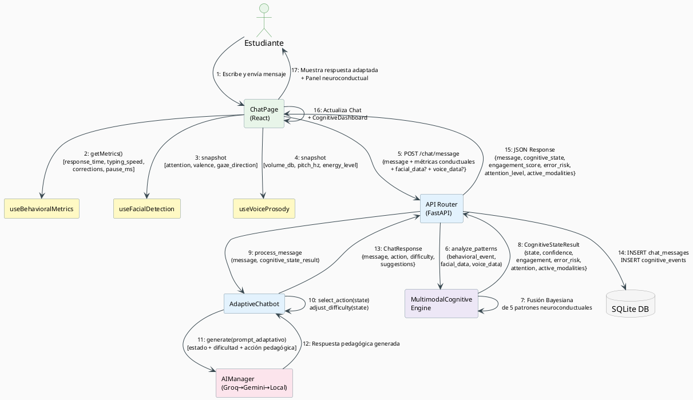

# 📐 Diagramas UML — NeuroLearn AI

> Basados en el código fuente real del proyecto (Abril 2026).
> Renderizar con: [https://www.plantuml.com/plantuml/uml/](https://www.plantuml.com/plantuml/uml/)

---

## 1. Diagrama de Clases

```plantuml
@startuml Clases_NeuroLearnAI

skinparam classAttributeIconSize 0
skinparam classFontSize 12
skinparam packageStyle rectangle
skinparam linetype ortho
skinparam shadowing false
skinparam backgroundColor #FAFAFA
skinparam class {
  BackgroundColor #FFFFFF
  BorderColor #555555
  ArrowColor #333333
  HeaderBackgroundColor #E8EAF6
}

' ============================================================
'  PAQUETE: BASE DE DATOS / MODELOS
' ============================================================
package "Modelos de Datos (SQLAlchemy)" #EDE7F6 {

  class User {
    + id : Integer <<PK>>
    + username : String
    + email : String
    + hashed_password : String
    + full_name : String
    + role : UserRole
    + is_active : Boolean
    + is_expert : Boolean
    + cognitive_profile : JSON
    + created_at : DateTime
  }

  enum UserRole {
    ESTUDIANTE
    PROFESOR
    ADMIN
  }

  class LearningSession {
    + id : Integer <<PK>>
    + user_id : Integer <<FK>>
    + bot_id : Integer <<FK>>
    + topic : String
    + started_at : DateTime
    + ended_at : DateTime
    + current_difficulty : DifficultyLevel
    + total_interactions : Integer
    + correct_responses : Integer
    + errors_count : Integer
    + avg_response_time_ms : Float
    + last_cognitive_state : CognitiveState
    + cognitive_state_history : JSON
  }

  enum CognitiveState {
    NORMAL
    FATIGUE
    OVERLOAD
    DOUBT
    MASTERY
    FLOW
    FRUSTRATION
    CURIOSITY
  }

  enum DifficultyLevel {
    BEGINNER
    EASY
    MEDIUM
    HARD
    EXPERT
  }

  class ChatMessage {
    + id : Integer <<PK>>
    + session_id : Integer <<FK>>
    + role : String
    + content : Text
    + timestamp : DateTime
    + response_time_ms : Float
    + cognitive_state_at_time : String
    + difficulty_at_time : String
  }

  class CognitiveEvent {
    + id : Integer <<PK>>
    + user_id : Integer <<FK>>
    + session_id : Integer <<FK>>
    + event_type : String
    + response_time_ms : Float
    + typing_speed_cpm : Float
    + error_rate : Float
    + correction_count : Integer
    + pause_duration_ms : Float
    + inferred_state : String
    + confidence_score : Float
  }

  class ExpertBot {
    + id : Integer <<PK>>
    + creator_id : Integer <<FK>>
    + name : String
    + description : Text
    + category : String
    + is_public : Boolean
    + system_prompt : Text
    + personality : JSON
    + knowledge_base : JSON
    + total_users : Integer
    + avg_rating : Float
    + effectiveness_score : Float
  }

  class BotTrainingData {
    + id : Integer <<PK>>
    + bot_id : Integer <<FK>>
    + data_type : String
    + content : JSON
    + order_index : Integer
    + is_critical : Boolean
  }

  class Classroom {
    + id : Integer <<PK>>
    + teacher_id : Integer <<FK>>
    + name : String
    + subject : String
    + grade : String
    + invite_code : String
    + max_students : Integer
    + is_active : Boolean
    + settings : JSON
    + generate_invite_code() : String
  }

  class Enrollment {
    + id : Integer <<PK>>
    + student_id : Integer <<FK>>
    + classroom_id : Integer <<FK>>
    + overall_progress : Float
    + total_sessions : Integer
    + average_score : Float
    + risk_level : String
    + risk_factors : JSON
  }
}

' ============================================================
'  PAQUETE: MOTOR DE IA (Backend Python)
' ============================================================
package "Motor de IA (Backend)" #E3F2FD {

  class AIManager {
    - providers : List
    - active_provider : String
    + generate(prompt, system_prompt) : String
    + get_active_provider() : String
  }

  class GroqProvider {
    - api_key : String
    - model : String
    + generate(prompt) : String
  }

  class GeminiProvider {
    - api_key : String
    - model : String
    + generate(prompt) : String
  }

  class AdaptiveChatbot {
    - ai_manager : AIManager
    - cognitive_engine : MultimodalCognitiveEngine
    - session_data : dict
    - current_difficulty : DifficultyLevel
    + start_session(topic, user_id, difficulty) : ChatResponse
    + process_message(message, behavioral_data) : ChatResponse
    + get_session_stats() : dict
    - adjust_difficulty(state) : void
    - select_action(state) : TeachingAction
  }

  class MultimodalCognitiveEngine {
    - interaction_analyzer : InteractionRhythmAnalyzer
    - decision_analyzer : DecisionSequenceAnalyzer
    - facial_analyzer : FacialMicroexpressionAnalyzer
    - voice_analyzer : VoiceProsodyAnalyzer
    - error_predictor : ErrorPredictionAnalyzer
    - temporal_buffer : deque
    + analyze(behavioral_event) : CognitiveStateResult
    - bayesian_fusion(scores) : CognitiveStateResult
    - temporal_smoothing(result) : void
  }

  class InteractionRhythmAnalyzer {
    + analyze(behavioral_event) : ModalityScore
  }

  class DecisionSequenceAnalyzer {
    + analyze(decision_event) : ModalityScore
  }

  class FacialMicroexpressionAnalyzer {
    + analyze(facial_data) : ModalityScore
  }

  class VoiceProsodyAnalyzer {
    + analyze(voice_data) : ModalityScore
  }

  class ErrorPredictionAnalyzer {
    + analyze(history) : ModalityScore
  }

  class CognitiveStateResult {
    + primary_state : CognitiveStateEnum
    + confidence : Float
    + state_scores : Dict
    + active_modalities : List
    + emotional_state : String
    + attention_level : Float
    + engagement_score : Float
    + error_risk : Float
    + recommendations : List
  }
}

' ============================================================
'  PAQUETE: FRONTEND (React / TypeScript)
' ============================================================
package "Frontend (React + TypeScript)" #E8F5E9 {

  class ChatPage {
    - selectedSkill : string
    - messages : ChatMessage[]
    - lastResponse : ChatMessageResponse
    - showDashboard : boolean
    + startSession(skill) : void
    + sendMessage(input) : void
    + endSession() : void
    + handleInputChange(val) : void
  }

  class CognitiveDashboard {
    - response : ChatMessageResponse
    - facialSnapshot : FacialSnapshot
    - voiceSnapshot : VoiceSnapshot
    - isVisible : boolean
    + renderGauges() : JSX
    + renderPatternBars() : JSX
    + renderLiveDetails() : JSX
  }

  class useBehavioralMetrics {
    - typingStartTime : number
    - botResponseTime : number
    - correctionCount : number
    + onBotMessageReceived() : void
    + onUserStartedTyping() : void
    + onInputChange(val, prev) : void
    + getMetrics(msg) : BehavioralMetrics
    + reset() : void
  }

  class useFacialDetection {
    - videoElement : HTMLVideoElement
    - stream : MediaStream
    - isRunning : boolean
    + startCamera() : Promise
    + stopCamera() : void
    - analyzeFrame() : void
    + snapshot : FacialSnapshot
  }

  class useVoiceProsody {
    - audioContext : AudioContext
    - analyserNode : AnalyserNode
    - stream : MediaStream
    + startMic() : Promise
    + stopMic() : void
    - analyzeAudio() : void
    + snapshot : VoiceSnapshot
  }
}

' ============================================================
'  RELACIONES - BASE DE DATOS
' ============================================================
User "1" -- "*" LearningSession : tiene >
User "1" -- "*" ExpertBot       : crea >
User "1" -- "*" CognitiveEvent  : genera >
User "1" -- "*" Enrollment      : posee >
User ..> UserRole               : usa

LearningSession "1" -- "*" ChatMessage     : contiene >
LearningSession "1" -- "*" CognitiveEvent  : registra >
LearningSession "*" -- "1" ExpertBot       : usa >
LearningSession ..> CognitiveState         : usa
LearningSession ..> DifficultyLevel        : usa

ExpertBot "1" -- "*" BotTrainingData : tiene >

Classroom "1" -- "*" Enrollment        : agrupa >
Classroom "*" -- "1" User              : < dirige

' ============================================================
'  RELACIONES - BACKEND IA
' ============================================================
AdaptiveChatbot --> MultimodalCognitiveEngine : consulta >
AdaptiveChatbot --> AIManager                 : usa >

AIManager --> GroqProvider   : prioridad 1 >
AIManager --> GeminiProvider : prioridad 2 >

MultimodalCognitiveEngine *-- InteractionRhythmAnalyzer
MultimodalCognitiveEngine *-- DecisionSequenceAnalyzer
MultimodalCognitiveEngine *-- FacialMicroexpressionAnalyzer
MultimodalCognitiveEngine *-- VoiceProsodyAnalyzer
MultimodalCognitiveEngine *-- ErrorPredictionAnalyzer
MultimodalCognitiveEngine ..> CognitiveStateResult : produce >

' ============================================================
'  RELACIONES - FRONTEND
' ============================================================
ChatPage *-- CognitiveDashboard   : contiene >
ChatPage o-- useBehavioralMetrics : usa >
ChatPage o-- useFacialDetection   : usa >
ChatPage o-- useVoiceProsody      : usa >

@enduml
```

---

## 2. Diagrama de Secuencia

> **Escenario:** El estudiante envía un mensaje durante una sesión de aprendizaje activa.

```plantuml
@startuml Secuencia_NeuroLearnAI

skinparam sequenceArrowThickness 2
skinparam roundcorner 8
skinparam maxmessagesize 120
skinparam sequenceParticipant underline
skinparam backgroundColor #FAFAFA
skinparam sequence {
  ArrowColor #37474F
  ActorBorderColor #37474F
  LifeLineBorderColor #78909C
  ParticipantBackgroundColor #FFFFFF
  ParticipantBorderColor #78909C
}

actor       "Estudiante"         as USR
participant "ChatPage\n(React)"  as UI  #E8F5E9
participant "useBehavioralMetrics\n+ useFacialDetection\n+ useVoiceProsody" as SENS #FFF9C4
participant "API FastAPI\n/chat/message"  as API  #E3F2FD
participant "AdaptiveChatbot"    as BOT  #E3F2FD
participant "MultimodalCognitive\nEngine" as NCE  #EDE7F6
participant "AIManager\n(Groq/Gemini/Local)" as LLM  #FCE4EC
database    "SQLite DB"          as DB   #F5F5F5

== Inicio de Sesión ==

USR -> UI : Selecciona habilidad\n(Ej: Matemáticas)
activate UI
UI -> API : POST /chat/start\n{topic, difficulty}
activate API
API -> BOT : start_session(topic, user_id, difficulty)
activate BOT
BOT -> LLM : generate(system_prompt + intro)
activate LLM
LLM --> BOT : Mensaje de bienvenida adaptado
deactivate LLM
BOT --> API : ChatResponse\n{message, cognitive_state: "normal"}
deactivate BOT
API -> DB : INSERT learning_sessions
API --> UI : JSON {message, state, suggestions}
deactivate API
UI --> USR : Muestra mensaje del tutor IA
deactivate UI

== Ciclo de Interacción (por cada mensaje) ==

USR -> UI : Escribe la respuesta
activate UI
UI -> SENS : onUserStartedTyping()
UI -> SENS : onInputChange(val, prev)\n[detecta velocidad, correcciones]

USR -> UI : Envía mensaje (Enter / botón)
UI -> SENS : getMetrics(mensaje)
activate SENS
SENS --> UI : BehavioralMetrics\n{response_time_ms, typing_speed_cpm,\ncorrections, pause_before_ms}

SENS -> SENS : useFacialDetection.snapshot\n{attention_score, valence, gaze}
SENS -> SENS : useVoiceProsody.snapshot\n{volume_db, pitch_hz, energy_level}
SENS --> UI : FacialData + VoiceData
deactivate SENS

UI -> API : POST /chat/message\n{message, response_time_ms, typing_speed_cpm,\ncorrections, pause_before_ms,\nfacial_data?, voice_data?}
activate API

API -> NCE : analyze_patterns(behavioral_event,\nfacial_data, voice_data)
activate NCE
NCE -> NCE : InteractionRhythmAnalyzer.analyze()
NCE -> NCE : DecisionSequenceAnalyzer.analyze()
NCE -> NCE : FacialMicroexpressionAnalyzer.analyze()
NCE -> NCE : VoiceProsodyAnalyzer.analyze()
NCE -> NCE : ErrorPredictionAnalyzer.analyze()
NCE -> NCE : bayesian_fusion(5 ModalityScores)
NCE --> API : CognitiveStateResult\n{state: "fatigue", confidence: 0.78,\nengagement: 0.45, error_risk: 0.62,\nattention: 0.5, active_modalities: [...]}
deactivate NCE

API -> BOT : process_message(message, cognitive_state_result)
activate BOT
BOT -> BOT : select_action(state)\n→ SIMPLIFY / ENCOURAGE / QUIZ...
BOT -> BOT : adjust_difficulty(state)\n→ Baja dificultad si hay fatiga
BOT -> LLM : generate(adaptive_prompt)\n[Prompt incluye: estado del estudiante,\ndificultad, acción pedagógica, tema]
activate LLM
LLM --> BOT : Respuesta pedagógica adaptada
deactivate LLM
BOT --> API : ChatResponse\n{message, action, difficulty, suggestions}
deactivate BOT

API -> DB : INSERT chat_messages\nINSERT cognitive_events
API --> UI : JSON {\n  message, cognitive_state: "fatigue",\n  engagement_score: 0.45,\n  error_risk: 0.62,\n  attention_level: 0.5,\n  active_modalities: ["interaction_rhythm",\n  "decision_sequence", "facial"],\n  suggestions: [...]\n}
deactivate API

UI -> UI : Actualiza mensajes del chat
UI -> UI : Actualiza CognitiveDashboard\n[Gauges, barras de patrones,\ndetalles en vivo de cámara y mic]
UI --> USR : Muestra respuesta adaptada\n+ Panel neuroconductual actualizado
deactivate UI

== Fin de Sesión ==

USR -> UI : Clic en "Terminar sesión"
activate UI
UI -> API : POST /chat/end
activate API
API -> BOT : get_session_stats()
BOT --> API : {total_interactions, avg_engagement,\ntime_in_flow_state, improvement_rate}
API -> DB : UPDATE learning_sessions\n(ended_at, session_summary)
API --> UI : Resumen de sesión
deactivate API
UI --> USR : Muestra estadísticas finales
deactivate UI

@enduml
```

---

## 3. Diagrama de Comunicación

> **Muestra los objetos activos y los mensajes numerados en secuencia cronológica.**

---

## 📌 Cómo renderizar estos diagramas

1. **Online (más fácil):** Ve a [https://www.plantuml.com/plantuml/uml/](https://www.plantuml.com/plantuml/uml/), pega el código entre `@startuml` y `@enduml` y descarga la imagen PNG.

2. **VS Code:** Instala la extensión **"PlantUML"** de jebbs. Abre este archivo y presiona `Alt+D` para previsualizar.

3. **Exportar para tesis:** Desde la web de PlantUML, usa el botón **"PNG"** para obtener imágenes de alta resolución listas para Word/PDF.
